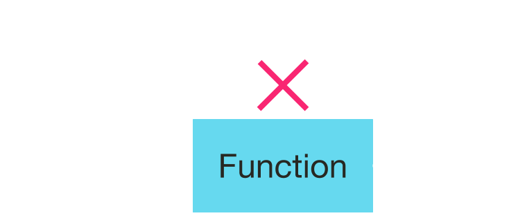
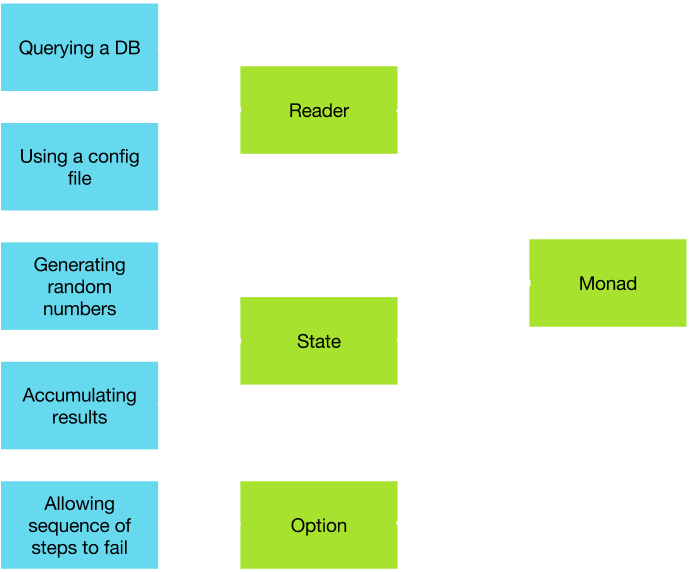

<style>
.reveal {
  font-size: 32px;
}
.reveal pre {
  width: 100%;
}
.reveal section img {
  margin: 15px 0px;
  background: transparent;
  border: 0px;
  box-shadow: 0 0 0px rgba(0, 0, 0, 0.15);
}
</style>

# Deriving functional programming

---

FP is characterized by one rule:

> No side effects.

---

## Two types of side effects

* A function does not affect outside data
* A function is not affected by outside data

The function is said to be _referentially transparent_.



---

## Forbidden: example #1

```tut:silent
trait MoneyConverter {
    var exchangeRate: Double = _

    def convert(value: Double): Double = exchangeRate * value
}
```

---

## Forbidden: example #2

```tut:silent
trait MoneyConverter {
    var exchangeRate: Double = _

    def updateExchangeRate(): Unit = {
        exchangeRate = 1.2
    }
}
```

---

## Forbidden: example #3

```tut
def eraseFirst(array: Array[Int]): Array[Int] = {
    array(0) = 0
    array
}

val someArray = Array(4, 2)

eraseFirst(someArray)

someArray
```

---

## Forbidden: example #4

```tut:silent
def formatNames(names: Seq[String]): Seq[String] = {
    var lowerCaseNames = Seq.empty[String]
    for(name <- names) {
        lowerCaseNames = lowerCaseNames :+ name.toLowerCase
    }
    lowerCaseNames
}
```

---

## Why FP?

When you don't aim for performance, but:
* readability
* ability to reason about the code
* parallelism/concurrency

---

## Why is FP not mainstream?


Hardware is inherently imperative!

---

## History

* Lambda calculus introduced in the 1930s by Church
* Lisp supported some features of FP in the 1950s
* John Backus (Turing Award, inventor of Fortran) in 1977: "Can Programming Be Liberated From the von Neumann Style?"
* ML was created in the 1970s, leading to ML variants and the Caml family
* In 1987 Haskell was born as open standard for functional programming research
* Work on Scala started in 2001, first public release in 2006

---

## Why FP now?

FP and imperative programming have a parallel history. So why is FP becoming mainstream now?
* FP is less efficient but that is less a concern today
* FP is a natural paradigm for concurrency (see Spark)
* Some impure functional languages like Scala allow devs to try out FP
* We can reason and trust FP code, that is good for complex codebases

---

## Deriving FP

What about the common FP characteristics?
* higher-order function
* immutable data
* lazy evaluation
* functors, monads and such
* ...

Let's derive (a reason for) them from the base rule.

> No side effects.

---

## Loops & higher-order functions

```tut:silent
def formatNames(names: Seq[String]): Seq[String] = {
    var lowerCaseNames = Seq.empty[String]
    for(name <- names) {
        lowerCaseNames = lowerCaseNames :+ name.toLowerCase
    }
    lowerCaseNames
}
```

```tut:silent
def formatNames(names: Seq[String]): Seq[String] = {
    names.map(_.toLowerCase)
}
```

```scala
def map[B](f: A => B): Seq[B]
```

---

## Immutable data

A good way to reduce side effects is to make it impossible to change the state of an object!

```tut:silent
def eraseFirst(array: Array[Int]): Array[Int] = {
    array(0) = 0
    array
}
```

`Array` is mutable. Enforcing immutability makes it impossible to write `eraseFirst` this way.

---

## While loops and recursion

```tut:silent
case class Node(children: List[Node])

def countNodesImp(tree: Node): Int = {
    var stack: List[Node] = List(tree)
    var nbNodes: Int = 0
    while(stack.nonEmpty) {
        nbNodes += 1
        stack = stack.head.children ++ stack.tail
    }
    nbNodes
}
```
```tut:silent
import scala.annotation.tailrec

def countNodesRec(tree: Node): Int = {
    @tailrec
    def rec(stack: List[Node], nbNodes: Int): Int = stack match {
        case Nil => nbNodes
        case h :: tl => rec(h.children ++ tl, nbNodes + 1)
    }
    rec(List(tree), 0)
}
```

---

## Lazy evaluation

Code is executed when needed.
```tut
val primes: Stream[Int] =
  Stream.from(2).filter(n => !(2 until n).exists(n % _ == 0) )
println(primes.take(10).toList)
```

---

## Lazy evaluation (2)

Execution order is not maintained.
Did I just lose determinism!?

As long as there is no side effect, no!
The result is unaffected by exectution order.

> In imperative programming, we execute statements.

> In functional programming, we compute results.

---

## Lazy evaluation (3) & parallelism

Spark code
```scala
val sentences: RDD[String] = ???
val words = sentences.flatMap(_.split(" "))
println(words.countApproxDistinct)
```
Spark logs show computation order is random.

---

## Recap

|FP requires or is facilitated by|FP enables|
|:-------------------------------|:---------|
|Immutable data|Readability|
|Higher-order functions|(Compiler) reasoning|
|Recursion|Lazy evaluation|
||Parallelism|
||Memoization|

---

## Wait, is that all?

How do I code in practice?


---

## Real-world code

|How do I|Answer|
|:-------|------|
|perform non-local control flow|`Option`, `Either`, `Try`|
|access configuration|`Reader`|
|maintain a state|`State`|
|perform IO|`Show`|
|compute in parallel|`Future`|
|log things|`Writer`|
|work with multiple values|`Seq`, `Set`, `Stream`, ...|

These are called "effects".
They make it possible to handle real cases without side effects.

---

## Effects

Effects are different in nature, but behave similarly.

Depending on their properties, they can be functors, applicatives, monads.



This second level of abstraction enables massive factorization of code, and sheds new light on the programming process.

---

That's for next time!

# Q & A
