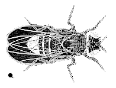
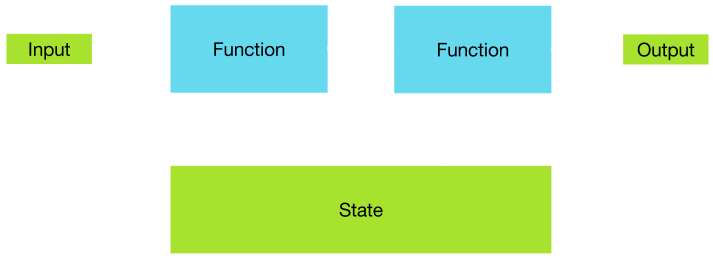
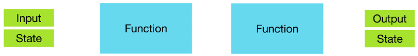
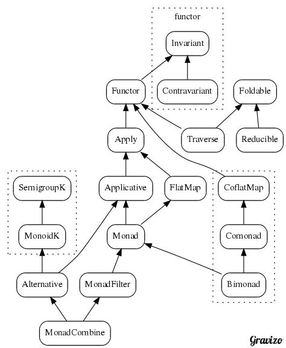

<style>
.reveal {
  font-size: 32px;
}
.reveal pre {
  width: 100%;
}
.reveal section img {
  margin: 15px 0px;
  background: transparent;
  border: 0px;
  box-shadow: 0 0 0px rgba(0, 0, 0, 0.15);
}
.reveal pre code {
  max-height: none;
}
</style>

# Effects in functional programming

---

## Last lecture in 2 min

FP is cool because:
* readability, ability to reason
* more compile-time checks
* lazy evaluation, parallelism, memoization

Where's the catch? FP requires **pure functions**.

> Pure = no side effect = no interaction with data outside of scope

---

## Rethink the way you code

* Higher-order functions instead of loops
* Recursion instead of (some) while loops
* Immutable data for safety

---

## What about those?

* Access a configuration
* Maintain a state
* Query a database
* Write to a file

All those are impure: they contain side effects!

---

## What do I do?


---

## Generating random numbers

Suppose I want to randomly generate a family of flies.
A boolean gene is passed on to progeny like this:

|Mother gene|Father gene|Child gene|
|:---------:|:---------:|:--------:|
|A|A|A|
|B|B|B|
|x|y|x with probability 60%|



---

## Java-style code

```tut:invisible
class Random(var seed: Long) {
    private def next(bits: Int): Int = {
        seed = (seed * 0x5DEECE66DL + 0xBL) & ((1L << 48) - 1)
        (seed >>> (48 - bits)).toInt
    }

    def nextDouble: Double = ((next(26).toLong << 27) + next(27)) * (1.0 / (1L << 53))

    def nextBoolean: Boolean = next(1) == 0
}
```

```tut:silent
case class Fly(gene: Boolean)

class FlyGenerator(val random: Random) {

    def spawnFly: Fly = Fly(random.nextBoolean)

    def spawnChild(mother: Fly, father: Fly): Fly = (mother, father) match {
        case (Fly(a), Fly(b)) if a == b => Fly(a)
        case (Fly(a), Fly(b)) => if(random.nextDouble <= 0.6) Fly(a) else Fly(b)
    }

    def spawnFamily: (Fly, Fly, Fly) = {
        val mother = spawnFly
        val father = spawnFly
        val child = spawnChild(mother, father)
        (mother, father, child)
    }
}
```

---

## Java-style code

Impure code: same function called with different results!

```tut
val generator = new FlyGenerator(new Random(42))
generator.spawnFamily
generator.spawnFamily
```

---

## Second try

```tut:silent
object FlyGenerator {

    def spawnFly(random: Random): Fly = Fly(random.nextBoolean)

    def spawnChild(random: Random, mother: Fly, father: Fly): Fly = (mother, father) match {
        case (Fly(a), Fly(b)) if a == b => Fly(a)
        case (Fly(a), Fly(b)) => if(random.nextDouble <= 0.6) Fly(a) else Fly(b)
    }

    def spawnFamily(random: Random): (Fly, Fly, Fly) = {
        val mother = spawnFly(random)
        val father = spawnFly(random)
        val child = spawnChild(random, mother, father)
        (mother, father, child)
    }
}
```

---

## Second try

```tut
FlyGenerator.spawnFamily(new Random(42))
FlyGenerator.spawnFamily(new Random(42))
val r = new Random(42)
FlyGenerator.spawnFamily(r)
FlyGenerator.spawnFamily(r)
```
Not much better...

`Random` is a mutable class.

---

## Heart of Darkness

```tut:silent
class Random(var seed: Long) {
    private def next(bits: Int): Int = {
        seed = (seed * 0x5DEECE66DL + 0xBL) & ((1L << 48) - 1)
        (seed >>> (48 - bits)).toInt
    }

    def nextDouble: Double = ((next(26).toLong << 27) + next(27)) * (1.0 / (1L << 53))

    def nextBoolean: Boolean = next(1) == 0
}
```

Each call generates the next value of the pseudo-random sequence.
Variable `seed` stores the last value.

How to make it pure?

---

## Imperative code



---

## Functional code



---

## Pure version of Random

```tut:silent
case class Seed(value: Long) {
    private def next(bits: Int): (Seed, Int) = {
        val newSeed = Seed((value * 0x5DEECE66DL + 0xBL) & ((1L << 48) - 1))
        (newSeed, (newSeed.value >>> (48 - bits)).toInt)
    }

    def nextBoolean: (Seed, Boolean) = {
        val (newSeed, bit) = next(1)
        (newSeed, bit == 0)
    }

    def nextDouble: (Seed, Double) = {
        val (newSeed1, leftPart) = next(26)
        val (newSeed2, rightPart) = newSeed1.next(27)
        val output = ((leftPart.toLong << 27) + rightPart) * (1.0 / (1L << 53))
        (newSeed2, output)
    }
}
```

---

## Back to the Family

```tut:silent
object FlyGenerator {

    def spawnFly(seed: Seed): (Seed, Fly) = {
        val (newSeed, b) = seed.nextBoolean
        (newSeed, Fly(b))
    }

    def spawnChild(seed: Seed, mother: Fly, father: Fly): (Seed, Fly) = (mother, father) match {
        case (Fly(a), Fly(b)) if a == b => (seed, Fly(a))
        case (Fly(a), Fly(b)) =>
            val (newSeed, d) = seed.nextDouble
            val newFly = if(d <= 0.6) Fly(a) else Fly(b)
            (newSeed, newFly)
    }

    def spawnFamily(seed: Seed): (Seed, (Fly, Fly, Fly)) = {
        val (newSeed1, mother) = spawnFly(seed)
        val (newSeed2, father) = spawnFly(newSeed1)
        val (newSeed3, child) = spawnChild(newSeed2, mother, father)
        (newSeed3, (mother, father, child))
    }
}
```

---

## Back to the family

It works just fine:

```tut
FlyGenerator.spawnFamily(Seed(42))
```

But it doesn't feel right: the code is clumsy.

---

## Abstraction time

What is it we do? We pass a state (the seed) throught chained calls to functions of type `S => (S, A)`.
Let's wrap those functions.

```tut:invisible:reset
case class Fly(gene: Boolean)
```
```tut:silent:invisible
object StateBlock { // tut issue

    case class State[S, A](run: S => (S, A)) {

        def get(s: S): A = run(s)._2

        def map[B](f: A => B): State[S, B] = State { state =>
            val (newState, a) = run(state)
            (newState, f(a))
        }

        def flatMap[B](f: A => State[S, B]): State[S, B] = State { state =>
            val (intermediateState, a) = run(state)
            f(a).run(intermediateState)
        }

    }

    object State {
        def pure[S, A](a: A): State[S, A] = State(s => (s, a))
    }

}
import StateBlock._
```
```scala
case class State[S, A](run: S => (S, A)) {

    def get(s: S): A = run(s)._2

    def map[B](f: A => B): State[S, B] = State { state =>
        val (newState, a) = run(state)
        (newState, f(a))
    }

    def flatMap[B](f: A => State[S, B]): State[S, B] = State { state =>
        val (intermediateState, a) = run(state)
        f(a).run(intermediateState)
    }

}

object State {
    def pure[S, A](a: A): State[S, A] = State(s => (s, a))
}
```

---

## State-powered seed

```tut:silent:invisible
object SeedBlock { // tut issue

    case class Seed(value: Long) {
        private def next(bits: Int): (Seed, Int) = {
            val newSeed = Seed((value * 0x5DEECE66DL + 0xBL) & ((1L << 48) - 1))
            (newSeed, (newSeed.value >>> (48 - bits)).toInt)
        }

        def nextBoolean: (Seed, Boolean) = {
            val (newSeed, bit) = next(1)
            (newSeed, bit == 0)
        }

        def nextDouble: (Seed, Double) = {
            val (newSeed1, leftPart) = next(26)
            val (newSeed2, rightPart) = newSeed1.next(27)
            val output = ((leftPart.toLong << 27) + rightPart) * (1.0 / (1L << 53))
            (newSeed2, output)
        }
    }

    object Seed { // only this companion object is new
        def nextBoolean: State[Seed, Boolean] = State(_.nextBoolean)
        def nextDouble: State[Seed, Double] = State(_.nextDouble)
    }

}
import SeedBlock._
```
```scala
case class Seed(value: Long) {
    private def next(bits: Int): (Seed, Int) = {
        val newSeed = Seed((value * 0x5DEECE66DL + 0xBL) & ((1L << 48) - 1))
        (newSeed, (newSeed.value >>> (48 - bits)).toInt)
    }

    def nextBoolean: (Seed, Boolean) = {
        val (newSeed, bit) = next(1)
        (newSeed, bit == 0)
    }

    def nextDouble: (Seed, Double) = {
        val (newSeed1, leftPart) = next(26)
        val (newSeed2, rightPart) = newSeed1.next(27)
        val output = ((leftPart.toLong << 27) + rightPart) * (1.0 / (1L << 53))
        (newSeed2, output)
    }
}

object Seed { // only this companion object is new
    def nextBoolean: State[Seed, Boolean] = State(_.nextBoolean)
    def nextDouble: State[Seed, Double] = State(_.nextDouble)
}
```

---

## State-powered flies

```tut:silent
object FlyGenerator {

    def spawnFly: State[Seed, Fly] = Seed.nextBoolean.map(Fly(_))

    def spawnChild(mother: Fly, father: Fly): State[Seed, Fly] = (mother, father) match {
        case (Fly(a), Fly(b)) if a == b => State.pure(Fly(a))
        case (Fly(a), Fly(b)) => Seed.nextDouble.map { d =>
            if(d <= 0.6) Fly(a) else Fly(b)
        }
    }

    def spawnFamily: State[Seed, (Fly, Fly, Fly)] =
        spawnFly.flatMap { mother =>
            spawnFly.flatMap { father =>
                spawnChild(mother, father).map { child =>
                    (mother, father, child)
                }
            }
        }
}
```

---

## State-powered flies

```tut:silent
object FlyGenerator {

    def spawnFly: State[Seed, Fly] = Seed.nextBoolean.map(Fly(_))

    def spawnChild(mother: Fly, father: Fly): State[Seed, Fly] = (mother, father) match {
        case (Fly(a), Fly(b)) if a == b => State.pure(Fly(a))
        case (Fly(a), Fly(b)) => Seed.nextDouble.map { d =>
            if(d <= 0.6) Fly(a) else Fly(b)
        }
    }

    def spawnFamily: State[Seed, (Fly, Fly, Fly)] =
        for {
            mother <- spawnFly
            father <- spawnFly
            child  <- spawnChild(mother, father)
        } yield (mother, father, child)
}
```

---

## State-powered flies

```tut
FlyGenerator.spawnFamily
FlyGenerator.spawnFamily.run
FlyGenerator.spawnFamily.run(Seed(42))
FlyGenerator.spawnFamily.get(Seed(42))
```

---

## Option

```tut:silent
def relativeDifference(a: Double, b: Double): Option[Double] = a match {
    case 0 => None
    case _ => Some((b - a) / a)
}

def findProductLength(productDB: Map[String, Double], id: String): Option[Double] =
    productDB.get(id)

def compareLengths(productDB: Map[String, Double],
                   productA: String, productB: String): Option[Double] =
    for {
        lengthA <- findProductLength(productDB, productA)
        lengthB <- findProductLength(productDB, productB)
        diff <- relativeDifference(lengthA, lengthB)
    } yield diff
```

---

## Sequence

```tut:silent
for {
    i <- 0 until 10
    j <- 0 until 10
} yield (i, j)
```

---

## Future

```tut:silent
import scala.concurrent.Future
import scala.concurrent.ExecutionContext.Implicits.global

def hardMath1(x: Double): Future[Double] = Future {
    Thread.sleep(1000)
    x * x
}

def hardMath2(x: Double, y: Double): Future[Double] = Future {
    Thread.sleep(1000)
    x + y
}

for {
    x <- hardMath1(42.0)
    y <- hardMath1(13.0)
    z <- hardMath2(x, y)
} yield z
```

---

## Here comes the monad

Surely there is no similarity of usage between `State`, `Seq`, `Option` and `Future`.
The similarity is in the structure:
```scala
    def pure[A](a: A): F[A]
    def flatMap[A, B](fa: F[A])(f: A => F[B]): F[B]
    def map[A, B](fa: F[A])(f: A => B): F[B] = flatMap(fa)(a => pure(f(a)))
```

This structure allows to chain computations, and is called a `Monad`.

A `Monad` is a context enriching the enclosed value with more information.

Why bother? Code reuse!

---

## Wait for a sequence of computations

```tut:book
import cats.Monad, cats.instances.all._
import scala.concurrent.Await, scala.concurrent.duration.Duration
def hardMath(i: Int) = Future(i)
val futureList = (0 until 10).map(hardMath).toList
val listFuture = Monad[Future].sequence(futureList)
Await.result(listFuture, Duration.Inf)
```

---

## Fail on a sequence of operations

```tut:book
def failOnZero(i: Int): Option[Int] = i match {
    case 0 => None
    case _ => Some(i)
}
val optionList = (0 until 10).map(failOnZero).toList
val listOption = Monad[Option].sequence(optionList)
```

---


## Rewrite Seed using cats's State

```tut:silent:invisible
import cats.data.State

object SeedBlock { // tut issue

    case class Seed(value: Long) {
        private def next(bits: Int): (Seed, Int) = {
            val newSeed = Seed((value * 0x5DEECE66DL + 0xBL) & ((1L << 48) - 1))
            (newSeed, (newSeed.value >>> (48 - bits)).toInt)
        }

        def nextBoolean: (Seed, Boolean) = {
            val (newSeed, bit) = next(1)
            (newSeed, bit == 0)
        }

        def nextDouble: (Seed, Double) = {
            val (newSeed1, leftPart) = next(26)
            val (newSeed2, rightPart) = newSeed1.next(27)
            val output = ((leftPart.toLong << 27) + rightPart) * (1.0 / (1L << 53))
            (newSeed2, output)
        }
    }

    object Seed { // only this companion object is new
        def nextBoolean: State[Seed, Boolean] = State(_.nextBoolean)
        def nextDouble: State[Seed, Double] = State(_.nextDouble)
    }
}
import SeedBlock._
```
```scala
import cats.data.State

case class Seed(value: Long) {
    private def next(bits: Int): (Seed, Int) = {
        val newSeed = Seed((value * 0x5DEECE66DL + 0xBL) & ((1L << 48) - 1))
        (newSeed, (newSeed.value >>> (48 - bits)).toInt)
    }

    def nextBoolean: (Seed, Boolean) = {
        val (newSeed, bit) = next(1)
        (newSeed, bit == 0)
    }

    def nextDouble: (Seed, Double) = {
        val (newSeed1, leftPart) = next(26)
        val (newSeed2, rightPart) = newSeed1.next(27)
        val output = ((leftPart.toLong << 27) + rightPart) * (1.0 / (1L << 53))
        (newSeed2, output)
    }
}

object Seed { // only this companion object is new
    def nextBoolean: State[Seed, Boolean] = State(_.nextBoolean)
    def nextDouble: State[Seed, Double] = State(_.nextDouble)
}
```

---

## Rewrite Fly using cats's State

```tut:silent

object FlyGenerator {

    def spawnFly: State[Seed, Fly] = Seed.nextBoolean.map(Fly(_))

    def spawnChild(mother: Fly, father: Fly): State[Seed, Fly] = (mother, father) match {
        case (Fly(a), Fly(b)) if a == b => State.pure(Fly(a))
        case (Fly(a), Fly(b)) => Seed.nextDouble.map { d =>
            if(d <= 0.6) Fly(a) else Fly(b)
        }
    }

    def spawnFamily: State[Seed, (Fly, Fly, Fly)] =
        for {
            mother <- spawnFly
            father <- spawnFly
            child  <- spawnChild(mother, father)
        } yield (mother, father, child)
}
```

---

## Create many fly families

```tut:book
type SeedState[A] = State[Seed, A]
val stateList = List.fill(10)(FlyGenerator.spawnFamily)
val listState = Monad[SeedState].sequence(stateList)
listState.runA(Seed(42)).value
```

---

## Sequence is for free

* There is a method `sequence` for all monads!
* The implementation is the same for all of them: it is independant of the specific monad.
* A new form of code factorization, based on structure!

---

## Monad laws

Having methods `pure` and `flatMap` is sufficient to infer `sequence`... Almost.

Monad laws for monad `F`:
```scala
// Left identity (for all f: A => F[B])
F.pure(a).flatMap(f) <-> f(a)

// Right identity (for all fa: F[A])
fa.flatMap(F.pure) <-> fa

// Associativity (for all fa: F[A], f: A => F[B], g: B => F[C])
fa.flatMap(f).flatMap(g) <-> fa.flatMap(a => f(a).flatMap(g))
```

---

## Many more monads (chained effects)

|How do I|Answer|
|:-------|------|
|perform non-local control flow|`Option`, `Either`, `Try`|
|access configuration|`Reader`|
|maintain a state|`State`|
|perform IO|`Show`|
|compute in parallel|`Future`|
|log things|`Writer`|
|work with multiple values|`Seq`, `Set`, `Stream`, ...|

---

## Many more typeclasses in cats



---

## How do I combine monads?

This is a hard problem.

Current answer: stack of monad transformers (see Haskell's `mtl` library).

A new contender: free-er monads. But only accepts commutative effects.

---

## Conclusion

* Real-world FP code implies highly abstract constructs
* Research is going fast: see Haskell FP community
* Many of those concepts will be familiar to most devs in a few years

---

# Q & A
